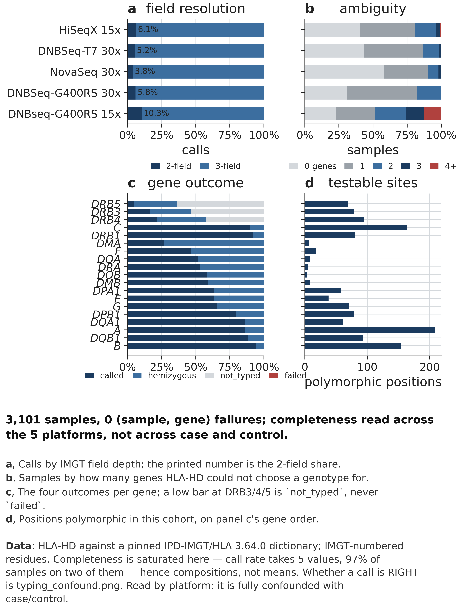
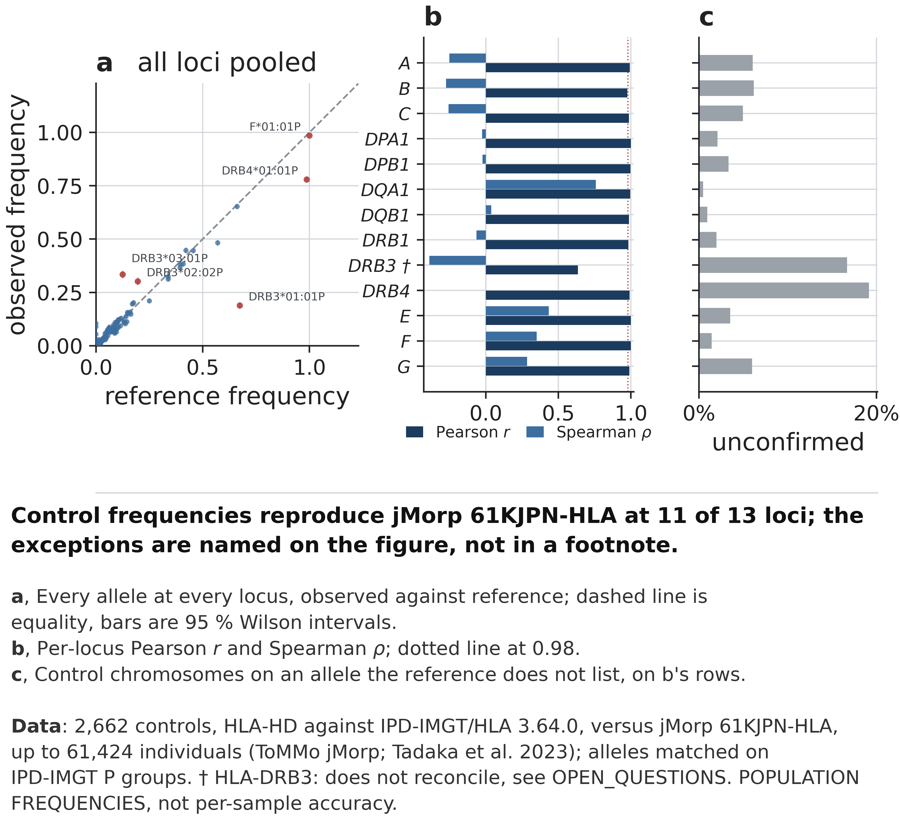
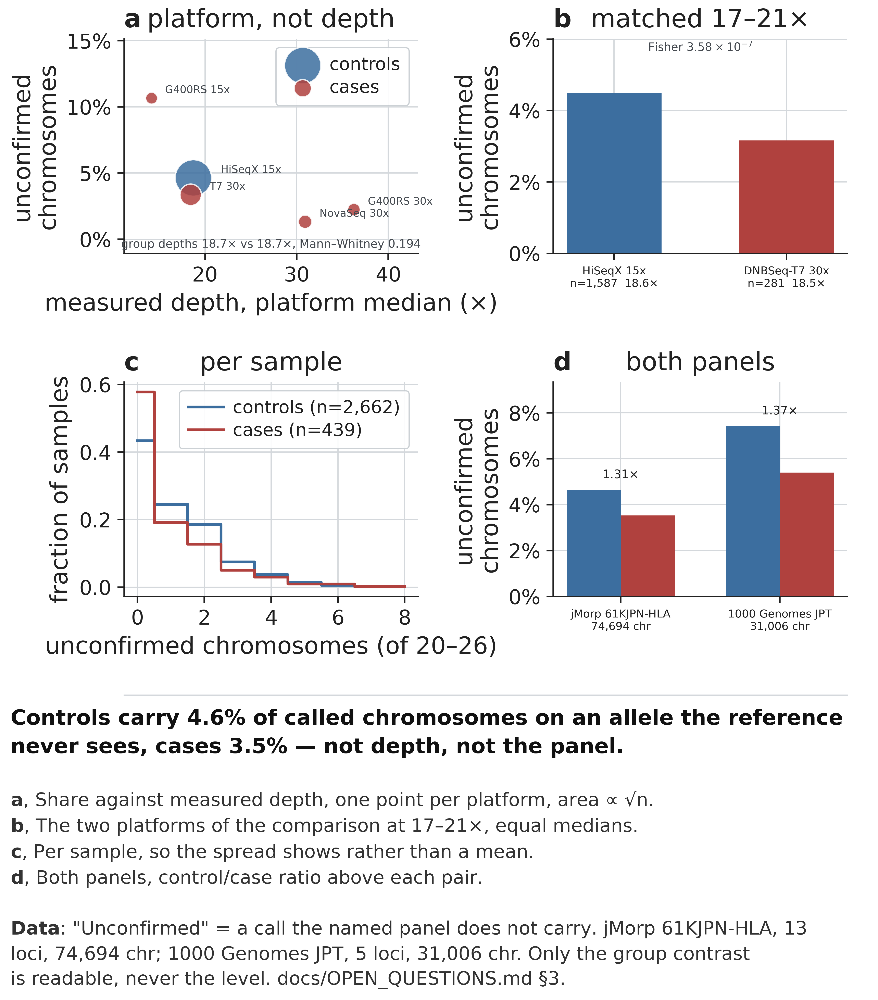

```{r setup}
#| include: false
# EVERY NUMBER IN THIS REPORT IS READ FROM results/_run_info/facts.json.
# Nothing is typed in. build_facts.py derives that file from the published tables,
# and verify.sh section 9 fails if a number appears in a document without being in
# it. So a re-render after any data change is either correct or fails loudly --
# which is the whole reason this report is a .qmd and not a .docx.
library(jsonlite)
library(knitr)
R    <- normalizePath("../results")
F    <- fromJSON(file.path(R, "_run_info", "facts.json"))$rendered
f    <- function(k) { v <- F[[k]]; if (is.null(v)) stop("no such fact: ", k); v }
tsv  <- function(p) read.delim(file.path(R, p), check.names = FALSE)
pct1 <- function(k) f(k)
```

::: {.callout-note}
## How to read this document

Every number below is generated from the published tables at render time, not typed
in. If a table changes and this document is re-rendered, the numbers change with it;
if a number here has no source, the render fails. The mechanism is
`scripts/build_facts.py` → `results/_run_info/facts.json` → this file, and
`./verify.sh` §9 enforces it.
:::

# What you are getting

Four tables, all keyed on `sample_id`, all covering exactly the `full_mainland`
cohort of **`r f("n_typed")`** samples (**`r f("n_typed_PH")`** CTEPH cases,
**`r f("n_typed_AGP3K")`** AGP3K controls).

| file | shape | what a column is |
|---|---|---|
| `04.residues/allele_dosage.tsv` | `r f("n_typed")` × `r f("n_allele_columns")` | one 2-field allele, e.g. `A*24:02`; the value is 0/1/2 copies |
| `04.residues/residue_dosage.tsv` | `r f("n_typed")` × `r f("n_residue_columns")` | one `GENE:position:aminoacid`, at **IMGT numbering**; 0/1/2 copies |
| `04.residues/residue_diplotype.tsv` | `r f("n_typed")` × `r f("n_diplotype_columns")` | one `GENE:position`; the value is the unordered pair of residues |
| `05.qc/allele_pgroup_map.tsv` | one row per allele | `in_reference` — whether a published Japanese panel lists this allele at all |

::: {.callout-warning}
## Read `sample_id` as a string

`r f("n_typed")` ids include some that carry leading zeros — `0000000123`, not
`123`. `pandas.read_csv` without `dtype` coerces the column to an integer and
silently drops them, and an inner merge then returns fewer rows with no error and no
warning.

```python
pd.read_csv(path, sep='\t', dtype={'sample_id': str})
```
:::

# Which samples these cover

Three filters, in order, and they are **not the same kind of decision**.

```{r chain}
data.frame(
  stage = c("v6 cohort (`Flag_JHRPv6 = True`)",
            "passed `wgs.auto.par` sample QC",
            "**`full_mainland` — the analysis cohort**"),
  rule  = c("the workbook",
            "quality: heterozygosity outliers removed",
            "**ancestry: mainland Japanese GMM clusters**"),
  n     = c(f("n_v6_flagged"), f("n_qc_pass"), f("n_typed")),
  removed = c("—", f("n_dropped_sample_qc"), f("n_dropped_ancestry")),
  check.names = FALSE
) |> kable()
```

The third filter is an **ancestry** decision, not a quality one, and the distinction
matters for how you read §4: the only external check available here asks whether a
called allele appears in a mainland Japanese reference panel, and a control who is not
mainland Japanese fails that check for a reason that has nothing to do with typing.
Restricting the cohort before typing removes that explanation by construction, so the
QC below measures typing rather than ancestry.

`full_mainland` is fixed on disk at `PopGMM_output/full_mainland.fid_iid.txt`. It is a
**strict subset of the QC-passing set** — `r f("n_cohort_outside_qc")` of its samples
fall outside it — so joining these matrices onto any mainland cohort roster is a
straight left join with nothing missing.

The `r f("n_dropped_ancestry")` samples the ancestry filter removed
(`r f("n_dropped_ancestry_AGP3K")` AGP3K, `r f("n_dropped_ancestry_PH")` PH) were typed
by an earlier run and are **not deleted**: their reads and HLA-HD output are kept under
`results/_superseded.3569/`. Extending to a wider sample set costs a re-run of
`collect_alleles.py`, not a re-run of HLA-HD.

# What was done

HLA-HD **1.7.1** against a **pinned** IPD-IMGT/HLA **3.64.0** dictionary, from reads
extracted over the chr6 MHC window plus every `chr6_*_alt` and `HLA*` contig of the
hs38DH the CRAMs were aligned to.

- **`r f("n_genes_typed")` genes typed.** IPD-IMGT/HLA publishes a protein alignment for
  **`r f("n_genes_with_residues")`** of them, and only those can carry residues. The rest
  keep their allele calls.
- **Residues come from IMGT's published alignments**, never from a recomputed one.
  Re-deriving them replaces IMGT numbering with an alignment column index that restarts
  per exon and moves with every release, so "DRB1 position 13" would be neither
  reproducible nor the position anyone else means.
- **Alleles are encoded at 2 fields** in `allele_dosage.tsv`, which is the resolution the
  external reference carries.
- **`r f("n_polymorphic_positions")` of `r f("n_reference_positions")` reference positions
  are polymorphic in this cohort** and are the ones emitted.

# Completeness

**`r f("n_failed_gene_calls")` (sample, gene) failures across the whole cohort.** That is
not luck: HLA-HD exits 0 whatever happens inside it, so every result is validated inside
the typing task itself, and a truncated result fails the task rather than being published.

```{r completeness}
s <- tsv("03.alleles/typing_status.tsv")
data.frame(
  outcome = c("called", "hemizygous", "not_typed", "failed"),
  n = c(f("n_called_gene_calls"), f("n_hemizygous_gene_calls"),
        f("n_not_typed_gene_calls"), f("n_failed_gene_calls")),
  meaning = c("two alleles resolved",
              "one allele resolved — for most genes this is real biology",
              "the gene is absent from that haplotype",
              "HLA-HD could not produce a call"),
  check.names = FALSE
) |> kable()
```



**A low bar at DRB3/4/5 is not a failure.** Their shortfall is entirely `not_typed`: the
gene is absent from that haplotype. Plotting it as a call rate shows correct biology as
if it were breakage, which is why panel (c) is a four-way composition.

Call rate is *k*/`r f("n_genes_with_residues")` and takes only
`r f("n_call_rate_values")` distinct values across the cohort, so it is a weak quality
signal here. Every panel of the figure is a composition for that reason.

# The external check

Completeness cannot see a call that was made confidently and is wrong. The only thing
that can, without a truth set, is whether the control allele frequencies reproduce
published Japanese ones.

**`r f("n_loci_concordant_jmorp")` of `r f("n_loci_jmorp")` loci reproduce
jMorp 61KJPN-HLA** (`r f("n_ref_individuals_jmorp")` individuals) at Pearson
*r* ≥ 0.98.



```{r concordance}
sm <- tsv("05.qc/allele_frequency_summary.tsv")
sm[, c("gene", "n_alleles", "n_chr_ctrl", "pearson_r", "spearman_rho", "max_abs_diff",
       "allele_at_max")] |> kable()
```

The per-locus scatters behind this are `figures/allele_frequency_loci.png`.

::: {.callout-important}
## `r f("worst_locus_jmorp")` is flagged and excluded from the headline

Its concordance is *r* = `r f("worst_locus_r_jmorp")` against
`r f("r_min_concordant_jmorp")` for the worst of the loci that pass. The reference
assigns every chromosome a `r f("worst_locus_jmorp")` allele and this pipeline does not,
and no mechanism tested accounts for the rest of the gap. Do not read
`r f("worst_locus_jmorp")` frequencies at face value.
:::

# Two constraints that bound what you may conclude

## DRB3, DRB4 and DRB5 dosages are wrong by construction

These three genes are **present or absent from a haplotype**. A sample carrying one copy
is genuinely hemizygous — but the pipeline writes a hemizygous call as two copies of the
same allele, so those columns of `allele_dosage.tsv` and `residue_dosage.tsv` read 2
where the truth is 1.

**The other `r f("n_genes_with_residues")` genes' residue columns are unaffected.** If a
DRB3/4/5 result matters, derive presence/absence from `03.alleles/allele_calls.tsv`
directly rather than from the dosage matrix. Details:
`docs/OPEN_QUESTIONS.md` §1.

## Controls are typed measurably worse than cases

This is the finding that most constrains what these calls can support.

**`r f("unconfirmed_AGP3K_jmorp")` of control chromosomes carry an allele the reference
panel never lists, against `r f("unconfirmed_PH_jmorp")` in cases** — a ratio of
**`r f("unconfirmed_ratio_jmorp")`**, Fisher *P* = `r f("fisher_p_group") ` for the
primary panel.



Three explanations are available and two of them are ruled out here.

- **Not depth.** Median measured depth is `r f("median_depth_controls")`× in controls and
  `r f("median_depth_cases")`× in cases, Mann–Whitney *P* = `r f("mannwhitney_p_depth")`.
  Restricted to the 17–21× window where the two largest platforms have equal medians, the
  shares are `r f("unconfirmed_matched_17_21x_HiSeqX_15x")` against
  `r f("unconfirmed_matched_17_21x_DNBSeq_T7_30x")`, Fisher
  *P* = `r f("fisher_p_matched")`.
- **Not the reference panel.** The same calls scored against a much smaller panel
  (`r f("n_ref_individuals_1kg")` individuals, `r f("n_loci_1kg")` loci) give
  `r f("unconfirmed_AGP3K_1kg")` against `r f("unconfirmed_PH_1kg")` — the *level* moves
  by more than half again, the *ratio* moves only from
  `r f("unconfirmed_ratio_jmorp")` to `r f("unconfirmed_ratio_1kg")`. The level belongs to
  the panel; the contrast does not.
- **Not ancestry.** The cohort is ancestry-restricted, so an unlisted allele cannot be
  explained by the sample not being mainland Japanese.

**What is left is platform, and it is perfectly confounded with phenotype.** Every control
is an AGP3K sample on HiSeqX; every case is a PH sample on something else. Which of read
length, library chemistry, alignment reference or batch is responsible cannot be
determined from these data.

::: {.callout-warning}
## The practical consequence

A common allele depleted more in controls than in cases reads as **enrichment in cases** —
a false risk association produced by the typing alone. Before testing a rare row of
`allele_dosage.tsv`, check it against `05.qc/allele_pgroup_map.tsv`: `in_reference = 0`
means no published Japanese panel lists that allele.
:::

# What these calls can and cannot support

**Order of robustness, most to least.**

1. **Class I residues** (A, B, C). A mis-call to a rare allele of the same 1-field family
   moves 2–5 of the locus's several hundred IMGT positions, so a residue test barely
   notices it. This is the analysis these calls support best.
2. **Class II residues** (DRB1, DQB1, DPB1, DQA1, DPA1). A tail mis-call moves tens of
   positions, but the class II tails are the smallest in the cohort — DQB1 at
   `r f("unconfirmed_ctrl_DQB1")` and DRB1 at `r f("unconfirmed_ctrl_DRB1")` of control
   chromosomes.
3. **`allele_dosage.tsv`, common alleles.** Fine, with the `in_reference` check above.
4. **`allele_dosage.tsv`, rare alleles.** Least robust. A rare allele is exactly where the
   differential in §6.2 lives.
5. **DRB3/4/5 dosages.** Do not use; see §6.1.

**What is not established.** There is no per-sample accuracy measurement anywhere in this
component. The frequency check compares *population frequencies*, so a set of errors that
happens to preserve the spectrum is invisible to it. Only typing samples with a published
type would settle it, and that is scoped and deferred in `docs/OPEN_QUESTIONS.md` §2.

# Appendix

## Parameters and pinned resources

```{r manifest}
m <- fromJSON(file.path(R, "_run_info", "run_manifest.json"))
flat <- vapply(m, function(v) paste(as.character(v), collapse = ", "), character(1))
data.frame(key = names(flat), value = unname(flat), check.names = FALSE) |> kable()
```

## Per-platform completeness

```{r platform}
tsv("05.qc/typing_qc_platform.tsv")[, c("platform", "n_samples", "call_rate_mean",
  "mean_field_depth_mean", "ambiguous_mean", "failed_mean")] |> kable()
```

## Every stratum behind the confounding figure

```{r confound}
tsv("05.qc/typing_confound.tsv") |> kable()
```

## Provenance

The tables and figures in this delivery were produced by **direct invocation** of the
component's scripts, with the exact command lines `hla.typing.nf` issues. They were not
produced by `nextflow -resume`: `extract_hla_reads.py` was edited after the typing run,
and a resume would re-run read extraction and cascade into HLA-HD — about 480 CPU-hours
re-reading 88 TB of CRAM to reproduce calls that already exist.

`./verify.sh` in the component root is the check that this document's numbers are current.
It re-derives the sample chain from the workbook and the two keep lists, re-derives the
concordance and confounding tables from their inputs, and fails on any number in any
document that is not in `facts.json` or in `docs/NUMBERS_ALLOWED.md`.

## Where everything lives

| | |
|---|---|
| method and rationale | `docs/METHODS.md` |
| output tree and data dictionary | `docs/OUTPUTS.md` |
| this study's numbers | `docs/STUDY_NOTES.md` |
| known defects, deliberately left in | `docs/OPEN_QUESTIONS.md` |
| the checks | `verify.sh` |
