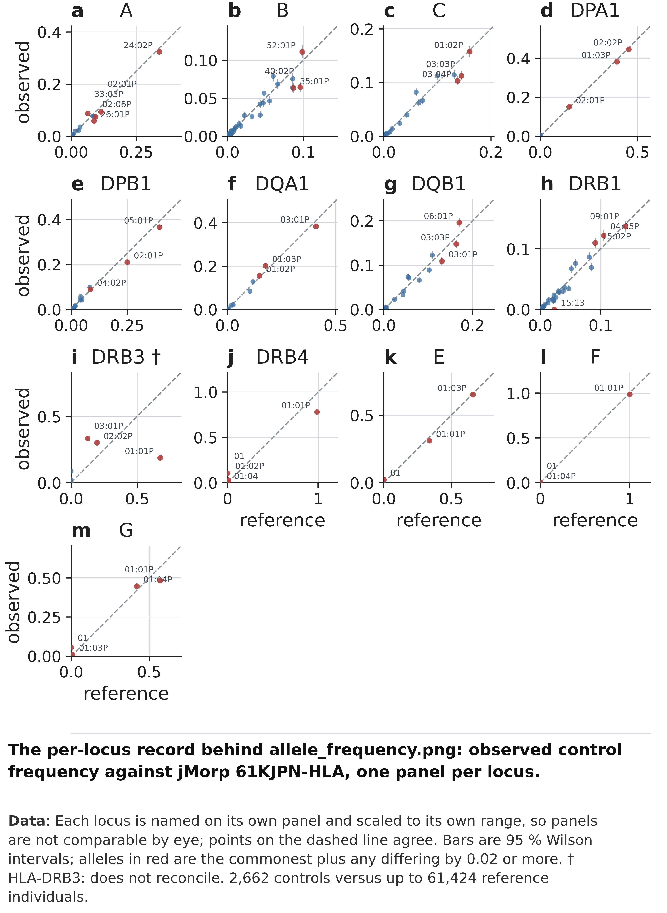

```{r setup}
#| include: false
# EVERY NUMBER IN THIS REPORT IS READ FROM results/_run_info/facts.json.
# Nothing is typed in. build_facts.py derives that file from the published
# tables. If a number is quoted here that the pipeline does not produce, the
# render ABORTS -- which is the whole reason this report is a .qmd and not a
# .docx, and it has already caught two mistakes.
library(jsonlite)
library(knitr)
R   <- normalizePath("../results")
F   <- fromJSON(file.path(R, "_run_info", "facts.json"))$rendered
f   <- function(k) { v <- F[[k]]; if (is.null(v)) stop("no such fact: ", k); v }
tsv <- function(p) read.delim(file.path(R, p), check.names = FALSE)
```

::: {.callout-tip}
## Who this is written for

**Someone who has never worked with HLA.** Section 2 explains the biology and the
notation from scratch; nothing after it assumes you read anything else first. If you
already type HLA routinely, skip to §3.

Every number below is generated from the published tables when this page is built, not
typed in by hand. If a table changes and the page is rebuilt, the numbers change with it;
if a number here has no source in the data, the build fails rather than printing something
stale.
:::

# What this document is

You are being handed a set of **HLA genotypes** for `r f("n_typed")` people —
`r f("n_typed_PH")` CTEPH cases and `r f("n_typed_AGP3K")` AGP3K controls — so that you
can test whether any of them associates with disease.

This document has one job: to let you use those genotypes **without having to trust them
blindly**. It says what was measured, how completely, how well it agrees with published
data, and — most importantly — the two specific ways it can mislead you if you are not
careful. Sections 6 to 8 are the quality evidence; §9 is the part to read before you
design an analysis.

# HLA in five minutes {#sec-primer}

Skip this section if you already know what `A*24:02` means.

## What the HLA genes do

Your immune system has to tell "self" from "not self". The proteins that do the actual
showing-of-evidence are made by a cluster of genes on chromosome 6 called **HLA** (Human
Leukocyte Antigen). An HLA protein picks up a short fragment of a protein from inside or
outside the cell and **displays it on the cell surface**, where T cells inspect it. Which
fragments a given HLA protein can hold is determined by the shape of its binding groove.

Two consequences follow, and they are why HLA matters to a genetics study:

* **HLA is the most variable region in the human genome.** There are tens of thousands of
  known versions of some of these genes, because a population that all carried the same
  version could be wiped out by one pathogen that evaded it.
* **Because the variation changes which fragments get displayed, HLA is associated with
  more diseases than any other locus** — autoimmune disease, infection, transplant
  rejection, drug reactions. If a disease has an immune component, HLA is worth testing.

## What "typing" means, and why it is harder than reading a SNP

For an ordinary variant you read one position and report one of two letters. HLA does not
work that way. The genes are so variable that the question is not "which letter is at this
position" but **"which of the thousands of known versions of this gene is this?"** —
and you have two of them, one from each parent.

So HLA typing is a *matching* problem: take the sequencing reads from the HLA region,
compare them against a catalogue of every known version, and decide which two versions
explain the reads best. That catalogue is called **IPD-IMGT/HLA**, and the version used
here is pinned so it cannot change under the study.

## How to read an allele name

A version of an HLA gene is called an **allele**, and its name looks like this:

```
A * 24 : 02 : 01 : 03
│   │    │    │    └── field 4: a difference outside the protein-coding part
│   │    │    └─────── field 3: a DNA difference that does NOT change the protein
│   │    └──────────── field 2: a difference that DOES change the protein
│   └───────────────── field 1: the broad family, roughly the old serological type
└───────────────────── the gene
```

The fields run from most consequential to least. **Field 2 is where the protein changes**,
which is why this delivery reports alleles at **two fields** — `A*24:02` — and stops
there. Reporting more fields would add digits that do not change the protein, would be
less reliable, and could not be compared against published population data, which is also
published at two fields.

## Residues, and why they are often the better test

A **residue** is one amino acid at one position in the protein. Because a `GENE:position:
aminoacid` combination is shared by many different alleles, a residue test asks a more
robust question than an allele test:

| | allele test | residue test |
|---|---|---|
| asks | "do people with `DRB1*15:01` get the disease more?" | "do people with a proline at DRB1 position 11 get it more?" |
| number of things tested | many, each rare | fewer, each common |
| if one rare allele is mis-called | that allele's result is wrong | usually unchanged, because the neighbouring allele has the same residue there |

Both are delivered. §9 says which to trust when they disagree.

## Why a gene can be present on one chromosome and absent from the other

Most genes come in two copies. Three of the HLA genes — **DRB3, DRB4 and DRB5** — do not:
whether you carry them at all depends on which version of the neighbouring DRB1 you
inherited. So a person can genuinely have **one copy, or none**. That is biology, not a
sequencing failure, and it produces two of the outcome labels you will see in §6:

* **hemizygous** — one copy present, one genuinely absent.
* **not typed** — the gene is absent from that person's haplotype altogether.

Neither means anything went wrong. **`failed` is the label that would mean something went
wrong, and it occurs `r f("n_failed_gene_calls")` times in this dataset.**

# What you are getting

Four tables, all keyed on `sample_id`, all covering exactly the same
**`r f("n_typed")`** people.

| file | shape | one column is | one cell is |
|---|---|---|---|
| `04.residues/allele_dosage.tsv` | `r f("n_typed")` × `r f("n_allele_columns")` | one 2-field allele, e.g. `A*24:02` | how many copies (0, 1, 2) |
| `04.residues/residue_dosage.tsv` | `r f("n_typed")` × `r f("n_residue_columns")` | one `GENE:position:aminoacid` | how many copies (0, 1, 2) |
| `04.residues/residue_diplotype.tsv` | `r f("n_typed")` × `r f("n_diplotype_columns")` | one `GENE:position` | the unordered pair of amino acids |
| `05.qc/allele_pgroup_map.tsv` | one row per allele | — | whether a published Japanese panel lists this allele at all |

The first two are what you will regress on. The fourth is the safety check §8 tells you to
apply before testing a rare allele.

::: {.callout-warning}
## Read `sample_id` as a string, always

`r f("n_leading_zero_ids")` of the `r f("n_typed")` sample ids begin with a zero.
`pandas.read_csv` without `dtype` turns the column into an integer and silently deletes
those zeros; an inner join then returns `r f("n_after_numeric_join")` rows instead of
`r f("n_typed")`, with no error and no warning.

```python
pd.read_csv(path, sep='\t', dtype={'sample_id': str})
```
:::

# Which people these cover

Three filters were applied in order, and **they are not the same kind of decision**.

```{r chain}
data.frame(
  step = c("1. in the v6 study cohort", "2. passed sequencing quality control",
           "3. **in the mainland ancestry cluster**"),
  `what it selects for` = c("being part of this study at all",
                            "the genome-wide data being usable",
                            "**sharing an ancestry background**"),
  remaining = c(f("n_v6_flagged"), f("n_qc_pass"), f("n_typed")),
  removed = c("—", f("n_dropped_sample_qc"), f("n_dropped_ancestry")),
  check.names = FALSE
) |> kable()
```

Step 2 is a **quality** decision: `r f("n_dropped_sample_qc")` people whose genome-wide
heterozygosity was anomalous were dropped upstream. For HLA typing those are exactly the
samples least likely to resolve cleanly into two versions of a gene, so inheriting that
decision is the right thing to do.

Step 3 is an **ancestry** decision, and it is the one worth understanding, because §8
depends on it. The only external check available for HLA calls is *"does the allele we
called appear in a published Japanese reference panel?"*. A control who is not of the same
ancestral background as that panel will fail that check for reasons that have nothing to
do with typing quality. Restricting the cohort first removes that explanation by
construction.

The `r f("n_dropped_ancestry")` people removed at step 3 were typed, and their results are
**not deleted** — they are kept under `results/_superseded.3569/`. Extending to a wider
sample set later costs a re-run of one collection script, not a re-run of the typing.

# How the typing was done

* **Reads** were taken from the whole HLA region of chromosome 6, plus every alternate and
  HLA-specific contig in the reference genome the data were aligned to — HLA is variable
  enough that reads from an unusual version will not map to the single "standard" copy.
* **HLA-HD `r f("hlahd_version")`** matched those reads against a **pinned** copy
  of the IPD-IMGT/HLA `r f("imgt_release")` catalogue. Pinned means a fixed copy on
  our own disk: the public catalogue is updated several times a year, and a reference that
  moves under a study is not a reference.
* **`r f("n_genes_typed")` genes** were typed. IPD-IMGT publishes a protein alignment for
  **`r f("n_genes_with_residues")`** of them, and only those can be turned into residues.
* **Residues come from IMGT's own published alignment**, never from a re-computed one, so
  "DRB1 position 11" means the same position everyone else means by it.
* Of the `r f("n_reference_positions")` positions in that alignment,
  **`r f("n_polymorphic_positions")` actually vary in this cohort** and are the ones
  delivered. A position where everybody has the same amino acid carries no information.

# How complete is it? {#sec-completeness}

**`r f("n_failed_gene_calls")` (sample, gene) failures across the entire dataset.** That is
not luck. The typing program exits successfully even when it has crashed internally, so
every result is checked *inside* the typing job and a truncated result fails that job
rather than being quietly published.


::: {.figure-note}
**Figure 1.** Typing completeness, by sequencing platform and by gene. Read this figure by
**platform**, not by case/control — see the note after panel (b).
:::

**What you are looking at.** Four views of "was a call produced, and how good was it",
none of which can tell you whether a call is *correct* — that is @sec-frequencies.

::: {.panels}
**(a) field resolution** — For each sequencing platform, what fraction of calls resolved to
2 fields and what fraction to 3. Remember from @sec-primer that field 2 is where the
protein changes: a 2-field call is already enough for everything in this delivery, and a
3-field call is a bonus. The printed white number is the 2-field share, so **a bigger
number means slightly less resolved calls**. The spread across platforms is
`r f("field2_share_min")` on `r f("platform_best_resolution")` to `r f("field2_share_max")` on `r f("platform_worst_resolution")` — real, but small.

**(b) ambiguity** — For each platform, how many samples had 0, 1, 2, 3 or 4+ genes where
the program could not choose between several equally good answers. This is the closest
thing to a per-call confidence score the method offers.

**(c) outcome per gene** — For each of the `r f("n_genes_with_residues")` genes that carry
residues, the fraction of people in each outcome. **This is the panel most likely to be
misread.** The three bars at the top — DRB5, DRB3, DRB4 — look bad and are not: their grey
`not_typed` block is the biology from @sec-primer, those genes being genuinely absent from
many haplotypes. There is no `failed` category drawn because there were no failures.

**(d) testable positions** — How many amino-acid positions in each gene actually vary in
this cohort, drawn on the same gene order as (c) so you can read a gene's completeness and
its usefulness together. HLA-A and HLA-B contribute the most testable positions; DMA, DOA,
DRA and DOB contribute almost none.
:::

**What to conclude.** Completeness is essentially saturated, so it is a *weak* quality
signal here: the call rate takes only `r f("n_call_rate_values")` distinct values across the
whole cohort and `r f("share_top_two_call_rates")` of people sit on two of them.
That is why every panel is a composition rather than an average — an average over a
saturated measurement hides the only variation there is.

**What this figure cannot tell you.** Whether any call is *right*. Every measurement here
is about whether a call was produced and how finely, not whether it names the correct
version of the gene.

**Why by platform, and not by case/control.** Every control was sequenced on one machine
type and every case on a different one, with no overlap. Any case/control difference in
these metrics is therefore inseparable from the machine, which is why the comparison is
never drawn that way. This becomes the central issue in §8.

# Do the calls agree with published data? {#sec-frequencies}

Completeness cannot see a call that was made confidently and is wrong. The only thing that
can, without re-typing samples of known type, is this: **if we call alleles correctly, the
frequencies we observe in our controls should reproduce the frequencies published for a
comparable population.** If the typing were systematically picking the wrong version, the
whole frequency spectrum would shift and no completeness metric would notice.

**`r f("n_loci_concordant_jmorp")` of `r f("n_loci_jmorp")` loci reproduce the reference at
a correlation of `r f("r_min_concordant_jmorp")` or better.**


::: {.figure-note}
**Figure 2.** Control allele frequencies against jMorp 61KJPN-HLA
(`r f("n_ref_individuals_jmorp")` individuals, `r f("n_loci_jmorp")` loci).
:::

::: {.panels}
**(a) all loci pooled** — One dot per allele. The horizontal position is the frequency the
reference publishes; the vertical position is the frequency we observe in our controls.
**A dot on the dashed line means we and the reference agree.** The vertical bars are 95 %
confidence intervals on our estimate. Red dots are the two commonest alleles and the three
furthest from the line, named so you can see which they are.

**(b) concordance** — For each locus separately, the correlation between the two sets of
frequencies. The dotted line is 0.98, the level above which a locus is
read at face value. Twelve of thirteen loci clear it comfortably; **HLA-DRB3 does not**,
and is marked with a dagger.

**(c) unconfirmed share** — For each locus, the fraction of our control chromosomes
carrying an allele the reference **does not list at all**. This is a different question
from (b): a locus can have excellent correlation on the alleles both sources share and
still put many chromosomes onto alleles the reference has never seen. Drawn on the same
rows as (b) so the two can be read together.
:::

**A caution about (b) that the numbers themselves make plain.** The table below reports
`n_shared` — how many alleles the two sources actually have in common at each locus. It
ranges from `r f("n_shared_max_jmorp")` at HLA-A down to **`r f("n_shared_min_jmorp")` at
HLA-`r f("locus_fewest_shared_jmorp")`**. A correlation computed where only two alleles are
shared is not meaningful, however high it looks. Read `r"$r$"` and `n_shared` together.

```{r concordance}
sm <- tsv("05.qc/allele_frequency_summary.tsv")
sm[, c("gene", "n_alleles", "n_shared", "n_chr_ctrl", "pearson_r", "max_abs_diff",
       "allele_at_max")] |> kable()
```



::: {.figure-note}
**Figure 3.** The same comparison, one panel per locus. This is the record behind Figure 2,
not a separate argument.
:::

Each panel is the same plot as Figure 2(a) restricted to one locus. **The axes are scaled
to each locus separately**, so panels cannot be compared with each other by eye — that is
what Figure 2(b) is for. Panel (i), HLA-DRB3, is the one to look at: its three commonest
alleles sit visibly off the line in both directions.

::: {.callout-important}
## HLA-DRB3 is flagged and excluded from the headline

Its correlation is `r f("worst_locus_r_jmorp")`, against `r f("r_min_concordant_jmorp")` for
the worst locus that passes. The reference assigns every chromosome a DRB3 allele and this
pipeline does not, and no mechanism we have tested accounts for the rest of the gap. Do not
read DRB3 frequencies at face value.
:::

# The one real quality problem {#sec-confound}

This is the section that most constrains what these genotypes can support.

Define **"unconfirmed"** as: a chromosome carrying an allele that the reference panel does
not list. Some unconfirmed calls are expected — no panel contains every rare allele. The
problem is not the level. **The problem is that the level differs between our cases and our
controls.**

**Controls: `r f("unconfirmed_AGP3K_jmorp")` of called chromosomes. Cases:
`r f("unconfirmed_PH_jmorp")`.** A ratio of **`r f("unconfirmed_ratio_jmorp")`**, Fisher
exact *P* = `r f("fisher_p_group")`.


::: {.figure-note}
**Figure 4.** Testing the two explanations that would make this finding go away.
:::

Three things could produce that difference. Two of them are tested here and neither
survives.

::: {.panels}
**(a) share vs depth** — One dot per sequencing platform. Horizontal: how much sequence
data that platform produced per person (its median depth). Vertical: the unconfirmed share.
Dot area is proportional to the number of people. **Read it twice.** First along the
*case* platforms alone — phenotype is held constant there, and the share clearly falls as
depth rises, so depth genuinely does matter. Then compare the large blue control dot with
the case dot sitting immediately below it at the same depth: same depth, different share.
The note inside the panel gives the two group medians and a test of whether they differ:
`r f("median_depth_controls")`× against `r f("median_depth_cases")`×,
*P* = `r f("mannwhitney_p_depth")`. **They do not.**

**(b) matched at 17–21×** — The same comparison restricted to people whose actual depth
falls in a narrow window where the two largest platforms have equal medians. If depth were
the cause, these two bars would be level. They are not:
`r f("unconfirmed_matched_17_21x_HiSeqX_15x")` against
`r f("unconfirmed_matched_17_21x_DNBSeq_T7_30x")`, *P* = `r f("fisher_p_matched")`.

**(c) per sample** — The distribution across individuals rather than the pooled average,
because an average would hide that most people have zero unconfirmed chromosomes and a tail
have several. The two curves are close, which is the honest picture: this is a modest shift
in a distribution, not two separate populations.

**(d) both panels** — The same case/control comparison computed twice, against two different
reference panels, from *identical* calls. The number above each pair is the control/case
ratio.
:::

## Why panel (d) matters more than it looks

"Unconfirmed" is defined by whichever reference panel you choose, so the obvious objection
is that the whole finding is an artefact of that choice. Panel (d) tests it, and the two
panels differ in **two ways at once**:

| | jMorp 61KJPN-HLA | 1000 Genomes JPT |
|---|---|---|
| individuals | `r f("n_ref_individuals_jmorp")` | `r f("n_ref_individuals_1kg")` |
| loci covered | `r f("n_loci_jmorp")` | `r f("n_loci_1kg")` |
| population sampled | Tohoku, north-east Japan | Tokyo region |
| unconfirmed, controls | `r f("unconfirmed_AGP3K_jmorp")` | `r f("unconfirmed_AGP3K_1kg")` |
| unconfirmed, cases | `r f("unconfirmed_PH_jmorp")` | `r f("unconfirmed_PH_1kg")` |
| **control/case ratio** | **`r f("unconfirmed_ratio_jmorp")`** | **`r f("unconfirmed_ratio_1kg")`** |

Neither panel is simply better. The larger one has seen far more of the rare Japanese
allele repertoire, which is why it leaves less unconfirmed. The smaller one samples a
population plausibly closer to our own cohort, but at a size where it cannot have observed
an allele carried by fewer than about one person in a hundred. Our cohort is neither of
those two populations; on the evidence of where it sits in Japanese population-structure
analyses, it lies between them.

**So the level moves a great deal between the two panels and the ratio barely moves at
all.** The absolute number belongs to the reference; the difference between our two groups
does not. That is a demonstration, not an assurance — and it is the reason this figure runs
both panels on every execution rather than picking one.

::: {.callout-note}
## The third explanation — ancestry — was removed before the data were produced

A control whose ancestry differs from the reference panel's would carry alleles the panel
has not seen, for reasons unrelated to typing. That is why the cohort was restricted to a
single ancestry cluster in §5 **before** any of these numbers were computed. Before that
restriction the same comparison gave `r f("superseded_unconfirmed_AGP3K_jmorp")` against
`r f("superseded_unconfirmed_PH_jmorp")`, a ratio of
`r f("superseded_unconfirmed_ratio_jmorp")`. Removing the benign explanation left the
finding essentially unchanged.
:::

## What is left, and what it means for you

Not depth. Not the reference panel. Not ancestry. **What remains is the sequencing
platform** — and every control was sequenced on one platform and every case on another,
with no overlap at all. Platform, cohort and phenotype are perfectly confounded, so it is
not possible from these data to say which of read length, library chemistry, alignment
behaviour or batch is responsible.

::: {.callout-warning}
## The practical consequence, stated plainly

If a common allele is under-called slightly more often in controls than in cases, it will
look like that allele is **enriched in cases** — a false disease association produced
entirely by the typing.

Before testing any rare allele from `allele_dosage.tsv`, check it against
`05.qc/allele_pgroup_map.tsv`. A value of `in_reference = 0` means no published Japanese
panel lists that allele at all. Of the `r f("n_alleles_carried")` alleles this cohort
carries, `r f("n_alleles_not_in_reference")` are flagged that way — but they are rare, which
is why the chromosome-weighted figure is only `r f("unconfirmed_cohort_jmorp")`.
:::

# What these calls can and cannot support

**In order of robustness, most to least.**

1. **Class I residues (A, B, C).** Most robust. A mis-call to a rare version of the same
   family typically moves only a handful of the several hundred amino-acid positions, so a
   residue test barely notices it. If you run one analysis, run this one.
2. **Class II residues (DRB1, DQB1, DPB1, DQA1, DPA1).** A mis-call moves more positions
   here, but the class II unconfirmed shares are the smallest in the cohort — DQB1 at
   `r f("unconfirmed_ctrl_DQB1")` and DRB1 at `r f("unconfirmed_ctrl_DRB1")`.
3. **`allele_dosage.tsv`, common alleles.** Sound, with the `in_reference` check above.
4. **`allele_dosage.tsv`, rare alleles.** Least robust — a rare allele is precisely where
   the §8 differential lives.
5. **DRB3, DRB4 and DRB5 dosages. Do not use them.** See the box below.

::: {.callout-important}
## DRB3/4/5 dosages are wrong by construction

@sec-primer explained that these three genes are genuinely present or absent from a
haplotype. A person carrying one copy is hemizygous — but the pipeline writes a hemizygous
call as **two copies of the same allele**, so those columns read 2 where the truth is 1.

The other `r f("n_genes_with_residues")` genes' residue columns are unaffected. If a
DRB3/4/5 result matters, derive presence/absence from `03.alleles/allele_calls.tsv`
directly rather than from the dosage matrix.
:::

**What is not established anywhere in this delivery.** There is no per-sample accuracy
measurement. The frequency check compares *population frequencies*, so a set of errors that
happens to preserve the overall spectrum would be invisible to it. Settling that would
require typing samples whose HLA type is already published, which is scoped and deferred in
`docs/OPEN_QUESTIONS.md` §2.

# Glossary {#sec-glossary}

Terms used in this document, in the figures, and as column names in the delivered files.

| term | 中文 | meaning |
|---|---|---|
| HLA | 人类白细胞抗原 | the gene cluster on chromosome 6 whose proteins display protein fragments to T cells |
| allele | 等位基因 | one specific known version of a gene |
| typing | 分型 | deciding which two known versions of a gene a person carries |
| field | 字段 | one colon-separated number in an allele name; field 2 is where the protein changes |
| 2-field | 二字段 | the resolution used throughout this delivery, e.g. `A*24:02` |
| residue | 残基 | one amino acid at one position in the protein |
| dosage | 剂量 | how many copies (0, 1 or 2) a person carries |
| diplotype | 双体型 | the unordered pair of amino acids at one position |
| locus | 位点 | one HLA gene, considered as a place in the genome |
| called | 已定型 | two versions resolved for this person at this gene |
| hemizygous | 半合子 | one version present and one genuinely absent — biology, not failure |
| not_typed | 未分型 | the gene is absent from this person's haplotype altogether |
| failed | 失败 | the method could not produce a call. Occurs `r f("n_failed_gene_calls")` times here |
| ambiguous | 存在歧义 | several candidate answers fitted the reads equally well |
| unconfirmed | 未被参考面板收录 | our call names an allele the reference panel does not list |
| in_reference | 是否在参考面板中 | the flag in `allele_pgroup_map.tsv` recording exactly that |
| reference panel | 参考面板 | published allele frequencies from an independent population |
| P group | P 组 | alleles grouped by identical protein in the binding region; how the reference names things |
| depth | 测序深度 | how many times each position was sequenced, on average |
| IPD-IMGT/HLA | IPD-IMGT/HLA | the international catalogue of known HLA alleles |
| cohort | 队列 | the set of people an analysis is run on |
| case / control | 病例 / 对照 | people with the disease / comparison group without it |

: {.glossary}

# Appendix {.appendix}

## Parameters and pinned resources

```{r manifest}
m <- fromJSON(file.path(R, "_run_info", "run_manifest.json"))
flat <- vapply(m, function(v) paste(as.character(v), collapse = ", "), character(1))
data.frame(key = names(flat), value = unname(flat), check.names = FALSE) |> kable()
```

## Completeness per sequencing platform

```{r platform}
tsv("05.qc/typing_qc_platform.tsv")[, c("platform", "n_samples", "call_rate_mean",
  "mean_field_depth_mean", "ambiguous_mean", "failed_mean")] |> kable()
```

## Every stratum behind Figure 4

```{r confound}
tsv("05.qc/typing_confound.tsv") |> kable()
```

## Provenance

The tables and figures here were produced by running this component's own scripts directly,
with the same command lines the pipeline issues. They were **not** produced by resuming the
pipeline: one of the read-extraction scripts was edited after the typing run, and a resume
would have re-run read extraction and cascaded into re-typing — hundreds of CPU-hours
re-reading tens of terabytes to reproduce calls that already existed.

`verify.sh` in the component root is the check that the numbers in this document are
current. It re-derives the sample chain from the source files, re-derives the concordance
and confounding tables from their inputs, and fails on any number in any document that is
not in `facts.json`.

## Where everything else lives

| | |
|---|---|
| method and rationale | `docs/METHODS.md` |
| output tree and data dictionary | `docs/OUTPUTS.md` |
| this study's numbers | `docs/STUDY_NOTES.md` |
| known defects, deliberately left in | `docs/OPEN_QUESTIONS.md` |
| the checks | `verify.sh` |
