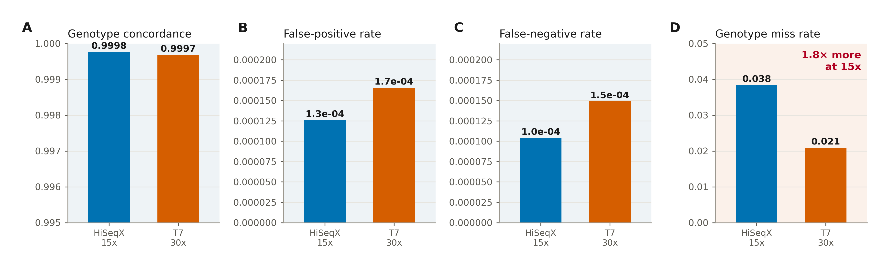
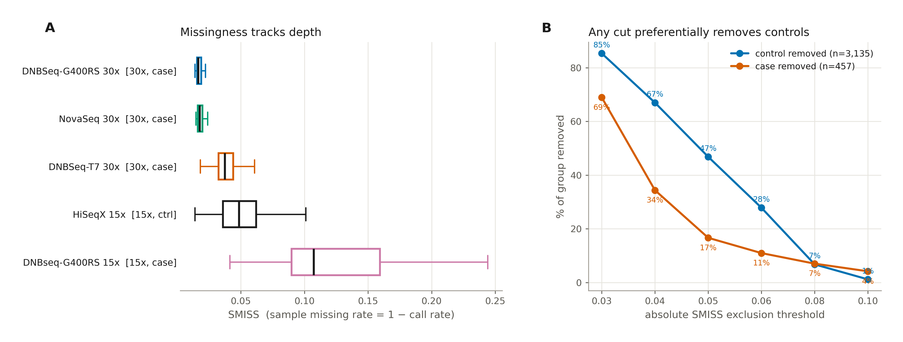
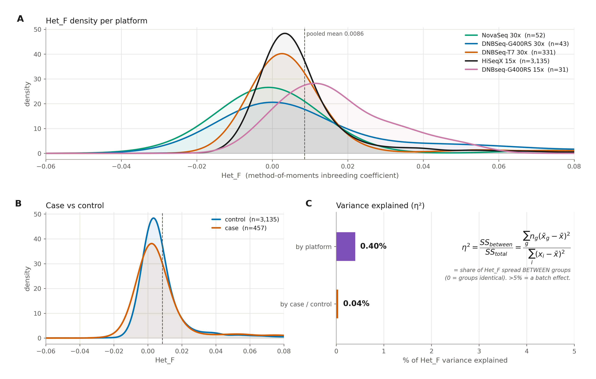
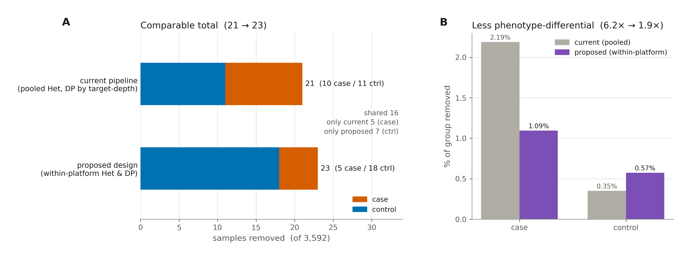

# Sample QC design for cteph_agp3k.v6 — reasoning and decision

*How we decided to do sample QC, and why. All numbers and figures are reproduced by
the scripts in `scripts/`; figures land in `figures/`.*

---

## 0. The setting that governs everything

This is a case-control WGS study where **sequencing platform is perfectly confounded
with phenotype, and depth is nearly so**:

| WGS_Platform | case | ctrl | depth |
|---|---:|---:|---|
| HiSeqX 15x | 0 | 3,135 | 15x |
| DNBSeq-T7 30x | 331 | 0 | 30x |
| NovaSeq 30x | 52 | 0 | 30x |
| DNBSeq-G400RS 30x | 43 | 0 | 30x |
| DNBseq-G400RS 15x | 31 | 0 | 15x |

- **PLATFORM ≡ phenotype, perfectly** (φ = 1.00): HiSeqX 15x is *exactly and only* the
  controls; every other platform is *exactly and only* cases. Every platform group is
  phenotype-pure.
- **DEPTH ≈ phenotype, near-perfectly** (φ = 0.96, R² = 0.92): 30x ⟹ 100% case;
  15x ⟹ 99% control. Only **31 cases (6.8%)** — the G400RS-15x cases — break the
  alignment, sitting in the otherwise control-dominated 15x stratum. So depth is a
  *near-perfect but not perfect* proxy for phenotype (not independent of it), and those
  31 cases are the **only within-data lever** that separates a depth effect from a
  phenotype effect. Caveat: their genotype quality is **not** covered by the concordance
  tuning (§1 was T7-30x + HiSeqX-15x only) and they carry the worst miss rate — so they
  are a lever to keep, but one to **validate directly**, not to assume good.

Two consequences:

1. Any **pooled** QC metric that genuinely varies by platform acts differentially on
   cases vs controls. The design question is *which* metrics that applies to.
2. Because platform ≡ phenotype (and depth ≈ phenotype), **stratifying to fix that is
   unavoidably almost phenotype-stratification** — every platform stratum is
   phenotype-pure. No QC choice can *de-confound* this cohort; stratification only
   avoids *adding* bias on top of the design confound. Real de-confounding needs
   external replication, where platform does not track phenotype. The justification for
   stratifying by platform is therefore the **technical cause + random-failure**
   argument (see §2), *not* any claim that platform/depth is independent of phenotype.

---

## 1. Keystone evidence — genotype accuracy is platform-equal; only miss rate differs

`figures/fig1_concordance.png` (source: `tuning.concordance.v5`, at the production
genotype filters DP≥8 / GQ≥20 / AF∈[0.2,0.8], WGS vs array):

| tuning stratum | n | concordance | FP rate | FN rate | miss rate |
|---|---:|---:|---:|---:|---:|
| HiSeqX-15x (= controls) | 1,441 | 0.99977 | 1.26e-4 | 1.04e-4 | **3.84%** |
| DNBSeq-T7-30x (= main case platform) | 309 | 0.99969 | 1.66e-4 | 1.49e-4 | **2.10%** |

Accuracy (concordance, FP, FN) is identical across depth; only miss rate differs (1.8×).
The scope and the panel-by-panel reading are in the Figure 1 caption below; the design
consequence is stated here.

**This single fact drives the whole design:** miss rate is a *benign, depth-driven*
quantity, not a sample-quality defect. Note the reason not to filter on it is
**benignity**, not independence — miss rate *is* aligned with phenotype (via depth,
φ=0.96). Removing samples on it would discard good low-depth samples, and because depth
tracks phenotype it would do so differentially by case/control.



> **Figure 1. WGS-vs-array genotype concordance by depth stratum, at the production
> genotype filters (DP ≥ 8, GQ ≥ 20, allele-fraction 0.2–0.8).** Bars compare the two
> depth strata of the v5 concordance experiment — HiSeqX-15x (n = 1,441; the control
> platform, blue) and DNBSeq-T7-30x (n = 309; the dominant case platform, orange).
> **(A)** genotype concordance, **(B)** false-positive rate, **(C)** false-negative rate
> are essentially identical between strata (blue-tinted "accuracy" panels); **(D)**
> genotype miss rate is the only metric that differs — 1.8× higher at 15x (peach panel).
> Genotype *accuracy* is depth-independent at these filters; only call *completeness*
> differs, so sample missingness is a benign, depth-driven quantity, not a quality
> defect. Scope: this validates T7-30x and HiSeqX-15x (96.5 % of the study); G400RS and
> NovaSeq platforms are not covered — in particular the 31 G400RS-15x cases (worst
> missingness, 0.107) remain unvalidated.

---

## 2. The reasoning, and the principle it yields

**The reasoning chain, in order:**

1. Platform ≡ phenotype (φ=1), depth ≈ phenotype (φ=0.96) — so nothing internal can
   *de-confound*; the goal is only to keep QC from *adding* bias (§0).
2. At the production genotype filters, T7-30x and HiSeqX-15x are **equally accurate**;
   only miss rate differs (§1). So miss rate is benign — do not exclude on it.
3. → sample missingness (**SMISS**, = 1 − call rate) is **not used at all** here (by
   design): it is the benign, confounded axis. The only depth metric is **DP** (catches
   failed libraries), and differential missingness is a *variant*-level job (**VMISS**)
   (§ "Sample missingness…").
4. A metric's *distribution* is what decides stratification: DP genuinely differs by
   platform (stratify), Het_F's mean does not (η²=0.4%) but its σ does (stratify the
   spread) (§ Het_F).
5. Stratify by the **technical cause** (platform), never by the **outcome** — even
   though here they nearly coincide, the justification and the purpose (remove random
   junk) are what make it legitimate.
6. Verify by **simulating the actual sample loss** — which is how the MAD-vs-SD error
   was caught (§5).

**The principle:**

> **Stratify a metric by the technical variable (platform) only where the metric's
> distribution genuinely varies by it, and only for removing random technical failures.
> Pool it where it does not vary. Handle the benign platform difference (miss rate) at
> the VARIANT level, not by removing samples.**

Per §0, "stratify by platform" here *is* almost "stratify by phenotype"; it is legitimate
**only** because the purpose is removing random technical junk (bad regardless of
phenotype, whole-sample removal). The line not to cross: stratifying a metric that has
*no* technical basis to differ (e.g. the **mean** of Het_F) — that would just condition
QC on the outcome.

Applying it metric by metric:

### Sample missingness (SMISS) is deliberately not a sample-QC axis (`figures/fig2_smiss_confound.png`)

> **Terminology.** *SMISS* = per-**sample** missing rate ( = 1 − the sample's call rate ).
> *VMISS* = per-**variant** missing rate. They are different metrics; only VMISS is
> filtered, and only at the variant level.

By design there is **no SMISS filter** in this step, and fig2 shows why that is the right
call. SMISS is exactly the one axis §1 identified as benign and confounded: it tracks
**depth** — both 15x platforms (HiSeqX-ctrl *and* G400RS-15x-case) miss the most — and
since all controls are 15x while most cases are 30x, **any absolute SMISS threshold
preferentially removes controls** (at 0.05: 46.8% of controls vs 16.6% of cases).
Filtering on it would throw away good control samples for a non-quality reason.

→ The only depth metric used at the sample level is **DP** (CRAM-validated — see
`../info/…EDIT_HISTORY.md`), for the *legitimate* depth job: catching a **failed
library**. SMISS stays a reported diagnostic only. Differential missingness is handled at
the **variant** level via VMISS (`30X_VMISS≤0.03 & 15X_VMISS≤0.04`, already in the
pipeline) — that is where missingness belongs, not sample removal.



> **Figure 2. Sample missingness (SMISS = 1 − call rate) is the confounded, benign axis
> — so it must not be a graded sample-exclusion metric.** **(A)** SMISS by platform
> (box = quartiles, whiskers = 1.5 × IQR): missingness tracks *depth* — both 15x
> platforms (HiSeqX-15x controls and G400RS-15x cases) miss the most, the 30x platforms
> least. **(B)** Because all controls are 15x and most cases are 30x, any absolute SMISS
> threshold removes controls far more than cases (e.g. 47 % vs 17 % at 0.05). Excluding
> on SMISS would discard good low-depth control samples for a non-quality reason;
> differential missingness is instead handled at the *variant* level (VMISS). (SMISS here
> is computed pre-variant-QC, so absolute values are inflated — the shape, not the level,
> is the point.)

### Het_F — mean is not confounded; spread is, mildly (`figures/fig3_hetf_confound.png`)

Quantified by one-way variance decomposition,
**η² = SS_between / SS_total = Σ nₘ(x̄ₘ − x̄)² / Σ(xᵢ − x̄)²** — the share of a metric's
total variance that lies *between* the groups (0% = group means identical; a batch
effect worth worrying about is usually >5%). Weighted by group size nₘ. Full derivation
in fig3 C.

- **η²(platform) = 0.40%**, **η²(case/ctrl) = 0.04%** — platform explains <0.5% of Het_F
  variance. The per-platform densities and the case/control densities coincide (panels
  A, B). The **mean** of Het_F is *not* confounded → the pooled window is correctly
  *located*.
- **But** η² only covers the mean. The per-platform **σ differs ~2×** (HiSeqX 0.0166 vs
  G400RS-30x 0.0282) and is **phenotype-aligned** (case platforms wider). A pooled ±5 SD
  window (HiSeqX-calibrated, since controls dominate) therefore has non-uniform
  sensitivity — it over-flags wide-σ case platforms and under-flags HiSeqX. Every flagged
  sample is extreme (|F| ≥ 0.095), so no benign sample is at risk either way; the effect
  is only on the case/control *balance* of who gets removed (quantified in §5).

→ Pooled is **acceptable** (tiny numbers, all extreme). But **per-platform mean ± 5·SD**
(location *and* spread within platform) is the more rigorous choice and costs nothing.

> **Use SD, not MAD, for Het_F.** An earlier version of this recommendation said
> "per-platform *robust-Z* (MAD)". That is wrong for Het_F: the distribution is peaked
> with a heavy positive tail, so MAD is tiny and a normal-calibrated |Z|>5 flags
> **182 samples** (5% of the cohort, mostly controls at F≈0.05–0.09, which is real
> distant consanguinity/structure — not bad samples). SD-based ±5·SD flags ~23. MAD is
> fine for the near-symmetric DP, but not for the heavy-tailed Het_F. This was caught
> only by simulating the actual sample loss (§5).



> **Figure 3. The heterozygosity metric Het_F is not confounded with platform (≈
> phenotype).** **(A)** Kernel-density estimates of Het_F for each platform; all five
> distributions coincide on the same peak (pooled mean 0.0086, dashed line). **(B)** Case
> (orange) and control (blue) densities overlap almost completely. **(C)** One-way
> variance decomposition (η² = SS_between / SS_total): platform explains 0.40 % of Het_F
> variance and case/control status 0.04 % — far below the ~5 % that would signal a batch
> effect. The pooled QC window is therefore correctly *located*; the only residual
> per-platform difference is in *spread* (σ), which motivates a within-platform window
> (§ Het_F).

---

## 3. The sample-QC recipe

Two graded filters + one bug fix. That is the whole of it.

| step | metric | stratify by | rule |
|---|---|---|---|
| ① failed library | Observed_Depth (CRAM-validated) | **platform** | robust-Z (MAD) < −3, one-sided low |
| ② contamination / swap | Het_F | **platform** | mean ± 5·**SD** (not MAD), two-sided* |
| ③ missing metrics | — | — | quarantine/flag, do **not** silently keep |

\* ② two-sided caveat: negative Het_F (excess heterozygosity) is the contamination
signature and should be removed; positive Het_F (excess homozygosity) is often genuine
consanguinity/structure — **flag and inspect** rather than auto-remove (a symmetric cut
would discard real inbred individuals).

**Never stratify by case/ctrl** (both metrics).

### What we deliberately do NOT do here

- **No sample-missingness (SMISS) filter** — §1 proves it is benign and confounded;
  differential missingness is a variant-level job (VMISS). SMISS stays a diagnostic only.
- **No sex check** — not part of this step.
- **DP as the only depth metric** — CRAM-validated across all platforms.

---

## 4. Before vs now — what changed and why

`before` = the pipeline as it runs today (`run_sample_qc.py`); `now` = the design above.

| item | before | now | why the change |
|---|---|---|---|
| **DP outlier grouping** | robust-Z within `Target_DP` (`{15x,30x}`) | robust-Z within **`WGS_Platform`** | "30x" pools T7 (~18x), NovaSeq (~30x), G400RS (~35x) — genuinely different depths; a normal T7 looks like a low outlier in that pool. Anomaly = "low *for its own platform*" ⇒ must be within-platform. |
| **Het_F window** | **pooled** mean ± 5·SD | **within-platform** mean ± 5·SD | σ differs ~2× by platform and is phenotype-aligned; the pooled (HiSeqX-calibrated) window over-flags wide-σ case platforms and under-flags HiSeqX. Within-platform makes sensitivity uniform. **SD, not MAD** (§2 box). |
| **Missing metrics** | silently **kept** (`fillna(False)`; NaN Het/DP, or absent from sheet) | **quarantine / flag** | "no data" must not read as "passed QC". |
| **`Observed_Depth`** | taken from the sheet as-is | same column, now **CRAM-validated** (T7 read-length fix) | the metric is unchanged; its trustworthiness improved — see `../info/…EDIT_HISTORY.md`. |

**Not changed and not added** (by design): no sample-missingness (SMISS) filter, no sex
check. Also unchanged: genotype-level filters (DP≥8/GQ≥20/AF), variant-level
depth-stratified missingness (VMISS), the pheno-blind stance.

---

## 5. Sample loss: before vs now (`figures/fig4_sample_loss.png`)

Simulated on the current metrics table. `before` removes **21**; `now` removes **23** —
comparable totals, but a different, better-balanced *set*:

| | total | case | ctrl |
|---|---:|---:|---:|
| before (pooled) | 21 | 10 | 11 |
| now (within-platform) | 23 | 5 | 18 |
| shared | 16 | | |
| only before | 5 | 5 | 0 |
| only now | 7 | 0 | 7 |

The change is **not** "remove more"; it is **remove more even-handedly**. The
case:control removal-rate ratio drops from **6.2× → 1.9×** (case 2.19%→1.09%, control
0.35%→0.57%): the pooled flow was dropping cases at 6× the control rate because the case
platforms are wider in Het_F; within-platform removes that artefact. The 5 "only-before"
samples are cases the pooled window over-flagged; the 7 "only-now" are genuine HiSeqX
control outliers the pooled window missed. DP within-platform fires on **0** samples
here (no failed libraries), so it is a safety net, not an active cut. The whole change is
therefore the single move Het_F pooled → within-platform.

**Note on the positive Het_F tail.** Most of the 23 flagged are excess-homozygosity
(positive Het_F). A one-time check confirmed these are overwhelmingly **real
consanguineous individuals**, not bad samples — so per the §3 footnote they should be
flagged/inspected, not blindly auto-removed. The design keeps only Het_F + DP; it does
not automate that inspection.

**The cautionary result in the same figure**: the rejected MAD variant would have
removed **182** — the single most important reason this section exists is that
simulating the loss caught a broken parameter choice that the reasoning alone did not.



> **Figure 4. Sample loss: current pipeline vs the proposed within-platform design.**
> **(A)** Samples removed, stacked by case (orange) / control (blue): the current pooled
> filter removes 21 (10 case / 11 control), the proposed within-platform filter 23
> (5 case / 18 control) — comparable totals, largely the same set (16 shared; 5 removed
> only by the current filter, 7 only by the proposed). **(B)** Per-group removal rate,
> current (grey) vs proposed (purple): the pooled filter drops cases at 6.2× the control
> rate — because case platforms are wider in Het_F — while the within-platform filter
> brings this to 1.9×, i.e. more even-handed, less phenotype-differential removal. The
> single substantive change is Het_F pooled → within-platform (DP within-platform fires
> on 0 samples here). *Not shown:* a MAD-based Het_F robust-Z (rejected) would remove
> **182** samples — MAD is inappropriate for the heavy-tailed Het_F; use SD.

---

## 6. Practical note

The design reduces to a single substantive change from the current pipeline: **Het_F
pooled → within-platform** (DP grouping also moves to platform, but fires on 0 samples
here; the silent-pass fix only matters if NaN-metric samples exist). It shifts the
removal set by ~9 samples (21→23) toward a more even case/control balance, but does not
change the total materially.

Changing it re-runs everything downstream (PopGMM, associations). Since the move is
small and the removed samples are all extreme Het_F outliers, it is **unlikely to change
the FTO/STBD1 conclusions** — so this is a rigour/cleanliness improvement, not a
correction that forces a re-run. Re-run if/when the cohort is next rebuilt for other
reasons.

---

## Files

```
tuning.sample_qc/
├── README.md                       ← this document
├── scripts/
│   ├── _style.py                   ← shared publication style (palette, rcParams, helpers)
│   ├── fig1_concordance.py         ← Fig 1: WGS-vs-array accuracy, T7-30x vs HiSeqX-15x (keystone)
│   ├── fig2_smiss_confound.py      ← Fig 2: why SMISS can't be a graded filter
│   ├── fig3_hetf_confound.py       ← Fig 3: Het_F platform/phenotype confound + η²
│   └── fig4_sample_loss.py         ← Fig 4: before vs now — which samples each flow removes (§5)
└── figures/
    ├── fig1_concordance.png
    ├── fig2_smiss_confound.png
    ├── fig3_hetf_confound.png
    └── fig4_sample_loss.png
```

Figures are numbered in order of appearance. Each script imports the shared
`_style.py` and is runnable standalone (`python3 scripts/figN_*.py`); inputs are the
merged sample-QC metrics table, the sample-info sheet, and the v5 concordance summary.
